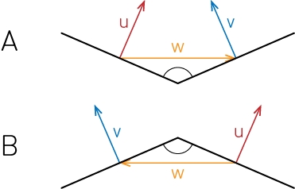

We have two normal vectors u and v and the problem is, that the faces of this two vectors can be concave (A) or convex (B).

We need a criterion to check which case we have.

Checking u and v for parallelity will not help us at this moment because in both cases their scalar product is positive.

Also the cross product will not get us anywhere because we do not know the order of the vectors.

We need additional information!

We use the midpoints of the two faces to construct a third vector w.

It will work also with other points as long as w connects the two faces, is not zero,…

Using the midpoints seems to be a good idea because we have already calculated them.

We see that for concave faces the angle between u and w is smaller than 180°.

For convex faces the angle is larger than 180°. So we can calculate the dot product of u and w.

Compare dot product of face normals.

Antiparallel vectors will have a negative dot product.

Parallel vectors will have a positive dot product.

According to the sign we use the smaller or the larger angle between u and v.

Finally we use this formula

  (Deg(x) + 180) mod 360

to convert the angle to degrees [Deg(x)], calculate the face angle [... -180] and make angles positive [(... +360) mod 360].